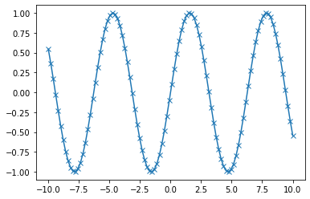
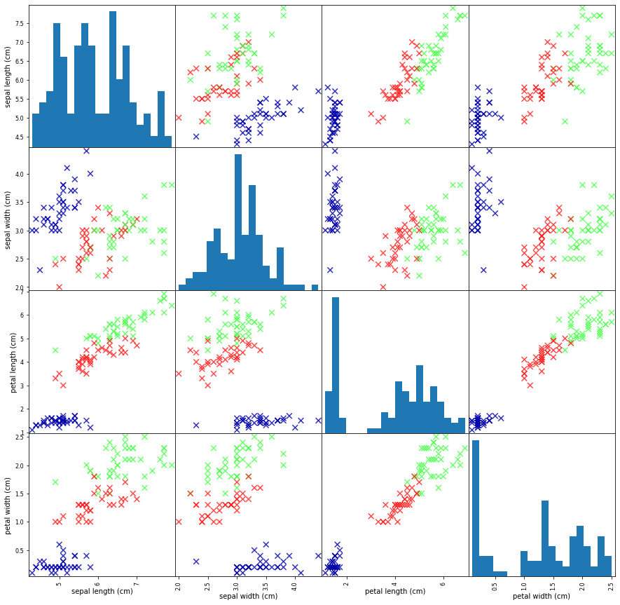

## [ 소개 ]
---

### [ 1. 왜 머신러닝인가? ]

#### (1) 머신러닝으로 풀 수 있는 문제
- `지도학습(supervised learning)`
    - 이미 알려진 사례를 바탕으로 일반화된 모델을 만들어 의사 결정 프로세스를 자동화하는 것
    - 입력 데이터로부터 기대한 출력이 나오도록 알고리즘을 가르치는 것이기 때문에  
    입력과 출력으로부터 학습하는 머신러닝 알고리즘들을 지도 학습 알고리즘이라 한다.  

    ex) 평집 봉투에 손으로 쓴 우펴번호 숫자 판별, 의료 영상 이미지에 기반한 종양 판단, 의심되는 신용카드 거래


- `비지도학습(unsupervised learning)`
    - 비지도 학습에서는 알고리즘에 입력은 주어지지만 출력은 제공되지 않는다.  

    ex) 블로그 글의 주제 구분, 고객들을 취향이 비슷한 그룹으로 묶기, 비정상적인 웹사이트 접근 탐지


- `지도학습`과 `비지도학습` 모두 컴퓨터가 인식할 수 있는 형태로 입력 데이터를 준비하는 것이 중요하다.
    - 데이터를 excel table처럼 준비하는 것
        - 하나의 개체 혹은 행 : `샘플(sample)` 또는 `데이터 포인트(data point)`
        - 샘플의 속성, 즉 열  : `특성(feature)`


- 그 어떤 머신러닝 알고리즘도 아무런 정보가 없는 데이터로는 그 어떤 것도 예측할 수 없다.

#### (2) 문제와 데이터 이해하기
- 머신러닝 프로세스에서 가장 중요한 과정

    > 1. 사용할 데이터를 이해하고  
    > 2. 그 데이터가 해결해야할 문제와 어떤 관련이 있는지를 이해하는 것

    - 데이터 셋으로 무엇을 하는 것인지 머신러닝 모델을 만들기 전에 반드시 이해해야한다.


- 머신러닝 솔루션을 만들 동안의 최소한 마음에 새겨둬야 하는 것들

    > - 어떤 질문에 대한 답을 원하는가? / 가지고 있는 데이터가 원하는 답을 줄 수 있는가?
    > - 내 질문을 머신러닝의 문제로 가장 잘 기술하는 방법은 무엇인가?
    > - 문제를 풀기에 충분한 데이터를 모았는가?
    > - 내가 추출한 데이터의 특성은 무엇이며 좋은 예측을 만들어낼 수 있을 것인가?
    > - 머신러닝 애플리케이션의 성과를 어떻게 측정할 수 있는가?
    > - 머신러닝 솔루션이 다른 연구나 제품과 어떻게 협력할 수 있는가?

---
### [ 2. 왜 파이썬인가? ]
- 파이썬은 데이터 적재, 시각화, 통계, 자연어 처리, 이미지 처리 등에 필요한 라이브러리들을 가지고 있다는 점


- 터미널이나 주피터 노트북같은 도구로 대화하듯 프로그래밍을 진행할 수 있다는 점


- 머신러닝과 데이터 분석은 근본적으로 반복 작업이다.  
이에 관하여 파이썬은 반복 작업을 빠르게 처리하고 손쉽게 조작할 수 있는 도구라는 점


- 복잡한 그래픽 사용자 인터페이스(GUI)나 웹 서비스도 만들 수 있으며 기존 시스템과 통합하기도 좋다.

---
### [ 3. scikit-learn ]
- 오픈 소스
- scikit-learn 관련 문서 : http://scikit-learn.org/stable/documentation
- scikit-learn 사용자 가이드 : http://scikit-learn.org/stable/user_guide.html
- scikit-learn API문서 : http://scikit-learn.org/stable/modules/classes.html

#### (1) scikit-learn 설치
- 기본적인 라이브러리 : `NumPy` 와 `SciPy` 사용
- 그래프 : `matplotlib` ... 등
- 대화식 개발 : `IPython`, `Jupyer Notebook` ... 등

---
### [ 4. 필수 라이브러리와 도구들 ]
- scikit-learn은 파이썬 과학 라이브러리인 `NumPy`와 `SciPy`를 기반으로 만들어졌다.

#### (1) `NumPy`
- 다차원 배열을 위한 기능과 선형 대수 연산과 푸리에 변환같은 고수준 수학 함수와 유사 난수 생성기를 포함
- ☑ scikit-learn에서 NumPy배열은 기본 데이터 구조에 해당한다.
    - NumPy의 핵심 기능은 다차원(n-차원) 배열인 `ndarray`클래스이다.
    - 이 배열의 모든 원소는 동일한 데이터 타입이어야 한다.
    - 다음 코드는 NumPy 배열의 예제이다.


```python
import numpy as np
x = np.array([[1,2,3],[4,5,6]])
print('x:\n', x)
```

    x:
     [[1 2 3]
     [4 5 6]]


- "NumPy의 ndarray 클래스의 객체"를 간단하게 Numpy배열 혹은 그냥 배열이라고 부른다...

#### (2) `SciPy`
- SciPy는 고성능 선형 대수, 함수 최적화, 신호 처리, 특수한 수학 함수와 통계 분포 등을 포함한 많은 기능을 제공한다.
- ☑ scikit-learn은 알고리즘을 구현할 때 Scipy의 여러 함수를 사용한다.  
ex) scipy.sparse - 희소행렬기능제공 : 0을 많이 포함한 2차원 배열을 저장할 때 사용


```python
from scipy import sparse

# 대각선 원소는 1이고 나머지는 0인 2차원 NumPy배열을 만든다.
eye = np.eye(4)
print('NumPy배열 :\n', eye)
```

    NumPy배열 :
     [[1. 0. 0. 0.]
     [0. 1. 0. 0.]
     [0. 0. 1. 0.]
     [0. 0. 0. 1.]]


- 희소행렬은 대부분의 값이 0 이므로 자료를 저장하는 효율성이 떨어진다.  
따라서, 저장효율을 높이기위해 key value와 dictionary를 아래와 같은 표현으로 사용한다.


```python
# NumPy 배열을 CSR포맷의 SciPy 희박 행렬로 변환한다.
# 0이 아닌 원소만 저장된다.
sparse_matrix = sparse.csr_matrix(eye)
print('SciPy의 CSR행렬:\n', sparse_matrix)
```

    SciPy의 CSR행렬:
       (0, 0)	1.0
      (1, 1)	1.0
      (2, 2)	1.0
      (3, 3)	1.0


- 보통 희소 행렬을 0이 모두 채워진 2차원 배열로부터 만들지 않으므로 희소행렬을 직접 만들 수 있어야한다.  
ex)
- 다음은 `COO 포맷`을 이용해서 앞서와 동일한 희소 행렬을 만드는 예제이다.


```python
data = np.ones(4)                                  # 1,1,1,1 의 값들을 의미
row = np.arange(4)                                 # row = 0, 1, 2, 3
col = np.arange(4)                                 # col = 0, 1, 2, 3
eye_coo = sparse.coo_matrix((data, (row, col)))    # 즉, data[0]의 1을 (0,0), data[1]의 1을 (1,1), ..., data[3]의 1을 (3,3)에 위치시킨다.
print('COO 표현:\n', eye_coo)
```

    COO 표현:
       (0, 0)	1.0
      (1, 1)	1.0
      (2, 2)	1.0
      (3, 3)	1.0


#### (3) `matplotlib`
- 파이썬의 대표적인 과학 계산용 그래프 라이브러리
- 주피터 노트북에서 사용할 때는 `%matplotlib notebook`이나 `%matplotlib inline` 명령어를 사용하면 브라우저에서 바로 이미지를 볼 수 있다.
- 다음 코드는 그래프를 그리는 간단 예제이다.


```python
%matplotlib inline
import matplotlib.pyplot as plt
# -10에서 10까지 100개의 간격으로 나뉘어진 배열을 생성한다.
x = np.linspace(-10, 10, 100)
# 사인 함수를 사용하여 y배열을 생성
y = np.sin(x)
# plot 함수는 한 배열의 값을 다른 배열에 대응해서 선 그래프를 그린다.
plt.plot(x, y, marker = 'x')
```


    [<matplotlib.lines.Line2D at 0x1e3fc2cbdf0>]





#### (4) `pandas`
- pandas는 데이터 처리와 분석을 위한 파이썬 라이브러리이다.
- pandas는 테이블을 수정하고 조작하는 다양한 기능을 제공한다.
- 특히, SQL처럼 테이블에 쿼리나 조인을 수행할 수 있다.
- SQL, EXCEL, CSV 파일 같은 다양한 파일과 같은 다양한 파일과 데이터베이스에서 데이터를 읽어 들일 수 있게 해준다.
- 다음 코드는 DataFrame을 만드는 간단한 예제이다.


```python
import pandas as pd
data = {
    'Name' : ['John','Anna', 'Peter', 'Linda'],
    'Loc' : ['New York', 'Paris', 'Berlin', 'London'],
    'Age' : [24, 13, 53, 33]
}

data_pandas = pd.DataFrame(data)
data_pandas
```


<div>
<style scoped>
    .dataframe tbody tr th:only-of-type {
        vertical-align: middle;
    }

    .dataframe tbody tr th {
        vertical-align: top;
    }

    .dataframe thead th {
        text-align: right;
    }
</style>
<table border="1" class="dataframe">
  <thead>
    <tr style="text-align: right;">
      <th></th>
      <th>Name</th>
      <th>Loc</th>
      <th>Age</th>
    </tr>
  </thead>
  <tbody>
    <tr>
      <th>0</th>
      <td>John</td>
      <td>New York</td>
      <td>24</td>
    </tr>
    <tr>
      <th>1</th>
      <td>Anna</td>
      <td>Paris</td>
      <td>13</td>
    </tr>
    <tr>
      <th>2</th>
      <td>Peter</td>
      <td>Berlin</td>
      <td>53</td>
    </tr>
    <tr>
      <th>3</th>
      <td>Linda</td>
      <td>London</td>
      <td>33</td>
    </tr>
  </tbody>
</table>
</div>


```python
# Age열의 값이 30이상인 모든 행을 선택
data_pandas[data_pandas.Age>30]
```


<div>
<style scoped>
    .dataframe tbody tr th:only-of-type {
        vertical-align: middle;
    }

    .dataframe tbody tr th {
        vertical-align: top;
    }

    .dataframe thead th {
        text-align: right;
    }
</style>
<table border="1" class="dataframe">
  <thead>
    <tr style="text-align: right;">
      <th></th>
      <th>Name</th>
      <th>Loc</th>
      <th>Age</th>
    </tr>
  </thead>
  <tbody>
    <tr>
      <th>2</th>
      <td>Peter</td>
      <td>Berlin</td>
      <td>53</td>
    </tr>
    <tr>
      <th>3</th>
      <td>Linda</td>
      <td>London</td>
      <td>33</td>
    </tr>
  </tbody>
</table>
</div>


#### (5) `mglearn`
- https://github.com/rickiepark/introduction_to_ml_with_python 에서 `git clone`가능
- 그래프나 데이터 적재와 관련된 세세한 코드를 일일이 쓰지 않아도 되게끔 해당 배움을 위해 만들어진 유틸리티 함수이다.
- 해당 책에서 간단하게 그림을 그리거나 필요한 데이터를 바로 불러들이기 위해 mglearn을 사용한다.

따라서 본 내용을 학습하기 위해 다음의 라이브러리들은 기본적으로 임포트한다고 가정한다.


```python
import numpy as np
import matplotlib.pyplot as plt
import pandas as pd
import mglearn
```

---
### [ 5. 첫 번째 애플리케이션 : 붓꽃의 품종 분류 ]
- 붓꽃의 품종을 정확하게 분류한 데이터를 가지고 있으므로 해당 문제는 `지도학습`에 해당한다.
- 몇 가지 선택사항(붓꽃의 품종) 중 하나를 선택하는 문제
    - 따라서, 해당 예제는 `분류(classification)`에 해당한다.
    - 출력될 수 있는 값(붓꽃의 종류)들을 `클래스(class)`라고 한다.
    - 데이터 포인트 하나(붓꽃 하나)에 대한 기대 출력은 꽃의 품종이되고, 이 품종을 `레이블(label)`이라 한다.

#### (1) 데이터 적재
- 사용되어질 데이터셋은 머신러닝과 통계 분야에서 오래전부터 사용해온 붓꽃 데이터셋이다.
- 이 데이터는 scikit-learn의 datasets모듈(`sklearn.datasets 모듈`)에 포함되어있다.
- 해당 모듈로부터 `load_iris`함수를 사용해서 데이터를 적재한다.


```python
from sklearn.datasets import load_iris
iris_dataset= load_iris()
```

- `load_iris`가 반환한 `iris`객체는 파이썬의 딕셔너리와 유사한 클래스의 객체이다.
- 즉, key와 value로 구성되어있다.


```python
print('iris_data의 key :\n', iris_dataset.keys())
```

    iris_data의 key :
     dict_keys(['data', 'target', 'frame', 'target_names', 'DESCR', 'feature_names', 'filename'])


```python
# DESCR 키에는 데이터셋에 대한 간략한 설명이 들어있다.
print(iris_dataset['DESCR'][:194] + '\n...')

print('\n========== 절취선 ==========\n')

# target_names의 값은 우리가 예측하려는 붓꽃 품종의 이름을 문자열 배열로 가지고 있다.
print('타깃의 이름 : ', iris_dataset['target_names'])

print('\n========== 절취선 ==========\n')

# feature_names의 값은 각 특성을 설명하는 문자열 리스트이다.
print('특성의 이름 : ', iris_dataset['feature_names'])
```

    .. _iris_dataset:

    Iris plants dataset
    --------------------

    **Data Set Characteristics:**

        :Number of Instances: 150 (50 in each of three classes)
        :Number of Attributes: 4 numeric, pred
    ...

    ========== 절취선 ==========

    타깃의 이름 :  ['setosa' 'versicolor' 'virginica']

    ========== 절취선 ==========

    특성의 이름 :  ['sepal length (cm)', 'sepal width (cm)', 'petal length (cm)', 'petal width (cm)']


```python
# 실제 데이터는 target과 data필드에 들어있다.
# data는 꽃잎/꽃받침의 길이와 폭을 수치값으로 가지고 있는 NumPy배열이다.
print('data의 타입 : ', type(iris_dataset['data']))
print('data의 타입 :\n', iris_dataset['data'][:10])
print('...')
```

    data의 타입 :  <class 'numpy.ndarray'>
    data의 타입 :
     [[5.1 3.5 1.4 0.2]
     [4.9 3.  1.4 0.2]
     [4.7 3.2 1.3 0.2]
     [4.6 3.1 1.5 0.2]
     [5.  3.6 1.4 0.2]
     [5.4 3.9 1.7 0.4]
     [4.6 3.4 1.4 0.3]
     [5.  3.4 1.5 0.2]
     [4.4 2.9 1.4 0.2]
     [4.9 3.1 1.5 0.1]]
    ...


- dat배열의 행은 개개의 꽃이 되며 열은 각 꽃에서 구한 네 개의 측정치이다.


```python
print('data의 크기 : ',iris_dataset['data'].shape)
```

    data의 크기 :  (150, 4)


- 해당 배열은 150개의 붓꽃 데이터를 가지고 있다.
- 머신러닝에서 각 아이템은 `샘플`이라하고 속성은 `특성`이라 부른다.
- 따라서,☑ data배열의 크기 = 샘플의 수 x 특성의 수


- 다음은 맨 처음 다섯 샘플의 특성 값이다.


```python
print('data의 처음 다섯 행 : \n', iris_dataset['data'][:5])
```

    data의 처음 다섯 행 :
     [[5.1 3.5 1.4 0.2]
     [4.9 3.  1.4 0.2]
     [4.7 3.2 1.3 0.2]
     [4.6 3.1 1.5 0.2]
     [5.  3.6 1.4 0.2]]


- 해당 데이터로부터  
다섯 붓꽃의 꽃잎 폭은 모두 0.2cm이고,  
첫 번째 꽃이 가장 긴 5.1cm의 꽃 받침을 가졌음을 알 수 있다.


- <class 'numpy.ndarray'> : `target` 배열도 샘플 붓꽃의 품종을 담은 Numpy 배열이다.
- (150,) : 각 원소가 붓꽃 하나에 해당하는 1차원 배열이다.
- 붓꽃의 종류는 0에서 2까지의 정수로 기록되어 있다.
- 각 숫자의 의미는 'target_names' 키에서 확인 할 수 있다.
    - 0 -> setosa
    - 1 -> versicolor
    - 2 -> virginica


```python
print('target의 타입 : ', type(iris_dataset['target']))
print()
print('target의 크기 : ', iris_dataset['target'].shape)
print()
print('타깃 :\n', iris_dataset['target'])
print()
print('타깃의 이름 : \n', iris_dataset['target_names'])
```

    target의 타입 :  <class 'numpy.ndarray'>

    target의 크기 :  (150,)

    타깃 :
     [0 0 0 0 0 0 0 0 0 0 0 0 0 0 0 0 0 0 0 0 0 0 0 0 0 0 0 0 0 0 0 0 0 0 0 0 0
     0 0 0 0 0 0 0 0 0 0 0 0 0 1 1 1 1 1 1 1 1 1 1 1 1 1 1 1 1 1 1 1 1 1 1 1 1
     1 1 1 1 1 1 1 1 1 1 1 1 1 1 1 1 1 1 1 1 1 1 1 1 1 1 2 2 2 2 2 2 2 2 2 2 2
     2 2 2 2 2 2 2 2 2 2 2 2 2 2 2 2 2 2 2 2 2 2 2 2 2 2 2 2 2 2 2 2 2 2 2 2 2
     2 2]

    타깃의 이름 :
     ['setosa' 'versicolor' 'virginica']


#### (2) 성과 측정 : 훈련 데이터와 테스트 데이터

> 해당 데이터로 머신러닝 모델을 만들고 새로운 데이터의 품종을 예측하려한다.  
> 하지만 만든 모델을 새데이터에 적용하기 전에 이 모델이 진짜 잘 작동하는지 알아야한다.  
> 다시 말해서, 만든 모델의 예측을 신뢰할 수 있는지 알아야한다.

- 모델이 훈련 데이터를 전부 기억할 수 있으니, 모델을 만들 때 쓴 데이터는 평가 목적으로 사용할 수 없다.
- 이렇게 데이터를 기억한다는 것은 모델을 잘 `일반화`하지 않았다는 것이다.  
(즉 새로운 데이터에 대해서는 잘 작동을하지 않는다.)


- 모델의 성능을 측정하려면 레이블(품종)을 알고 있는 새 데이터 모델을 적용해봐야 한다.
- 이를 위해 가지고 있는 레이블된 데이터(150개의 붓꽃데이터)를 두 그룹으로 나눈다.
    - `훈련 데이터`혹은 `훈련 세트` : 그룹 하나는 머신러닝 모델을 만들때 사용
    - `테스터 데이터`,`테스트 세트`, 혹은 `홀드아웃 세트` : 나머지는 모델이 얼마나 잘 작동되는지 측정하는 데 사용


- `scikit-learn`은 데이터셋을 섞어서 나눠주는 `train_test_split`함수를 제공한다.
    - 전체 행 중 75%를 레이블 데이터와 함께 `훈련 세트`로 뽑는다.
    - 나머지 25%는 레이블 데이터와 함께 `테스트 세트`가 된다. (해당 비율이 일반적으로 좋은 선택에 해당)


- `scikit-learn`에서는 `데이터는 대문자X`로 표기하고 `레이블은 소문자y`로 표기한다.
    - 이는 수학에서 f(x)=y에서 유래되었다.
    - 2차원 배열(행렬)이므로 대문자 X, 1차원 배열이므로 소문자를 사용 y


```python
from sklearn.model_selection import train_test_split
X_train,X_test,y_train,y_test = train_test_split(iris_dataset['data'], iris_dataset['target'], random_state=0)
# random_state : 난수 생성기 옵션
# random_state = 0일때, 해당 함수를 여러번 실행해도 결과가 똑같이 나옴
```


```python
print('X_train 크기 : ', X_train.shape)
print('y_train 크기 : ', y_train.shape)
```

    X_train 크기 :  (112, 4)
    y_train 크기 :  (112,)


```python
print('X_test 크기 : ', X_test.shape)
print('y_test 크기 : ', y_test.shape)
```

    X_test 크기 :  (38, 4)
    y_test 크기 :  (38,)


#### (3) 가장 먼저 할 일 : 데이터 살펴보기

> 머신러닝 모델을 만들기 전에  
> 머신러닝이 없어도 풀 수 있는 문제는 아닌지, 혹은 필요한 정보가 누락되지는 않았는지 데이터를 조사해보는 것이 좋다.  
> ex) 붓꽃의 데이터 중 일부가 센티미터가 아닌 인치로 되어있는 경우

- ☑ 시각화는 데이터를 조사하는 아주 좋은 방법이다.
    - `산점도(scatter plot)` :  
        - 데이터에서 한 특성을 x축에 놓고 다른 하나는 y축에 놓아 각 데이터 포인트를 하나의 점으로 나타내는 그래프
        - 아쉽게도 컴퓨터 화면은 2차원이라 한 번에 2개(혹은 3개)의 특성만 그릴 수 있다.
    - `산점도 행렬(scatter matrix)` :
        - 모든 특성을 짝지어 만듬
        - 4개의 특성을 가진 붓꽃의 경우처럼 특성의 수가 적다면 꽤 괜찮은 방법
        - (주의)  
        한 그래프에 모든 특성의 관계가 나타나는 것이 아니기 때문에  
        각각의 나누어진 산점도 그래프에는 드러나지 않는 중요한 성질이 있을 수 있다.


```python
import pandas as pd
import mglearn
# 그래프를 그리기위해 NumPy배열을 pandas의 DataFrame으로 변경!
# X_train 데이터를 사용해서 데이터 프레임을 만든다.
# 열의 이름은 iris_dataset의 feature_names에 있는 문자열을 사용한다.
iris_df = pd.DataFrame(X_train, columns = iris_dataset['feature_names'])
# 데이터프레임을 사용해 y_train에 따라 색으로 구분된 산점도 행렬을 만든다.
pd.plotting.scatter_matrix(iris_df,
                           c=y_train,
                           figsize=(15, 15),
                           marker='x',
                           hist_kwds={'bins': 20},
                           s=60,
                           alpha=.8,
                           cmap=mglearn.cm3)
```


    array([[<matplotlib.axes._subplots.AxesSubplot object at 0x000001B0A645ABE0>,
            <matplotlib.axes._subplots.AxesSubplot object at 0x000001B0A6E2E850>,
            <matplotlib.axes._subplots.AxesSubplot object at 0x000001B0A71522E0>,
            <matplotlib.axes._subplots.AxesSubplot object at 0x000001B0A717BA60>],
           [<matplotlib.axes._subplots.AxesSubplot object at 0x000001B0A71B0250>,
            <matplotlib.axes._subplots.AxesSubplot object at 0x000001B0A71D88E0>,
            <matplotlib.axes._subplots.AxesSubplot object at 0x000001B0A71D89D0>,
            <matplotlib.axes._subplots.AxesSubplot object at 0x000001B0A720D1F0>],
           [<matplotlib.axes._subplots.AxesSubplot object at 0x000001B0A7260100>,
            <matplotlib.axes._subplots.AxesSubplot object at 0x000001B0A7296850>,
            <matplotlib.axes._subplots.AxesSubplot object at 0x000001B0A72BFFD0>,
            <matplotlib.axes._subplots.AxesSubplot object at 0x000001B0A5DE39A0>],
           [<matplotlib.axes._subplots.AxesSubplot object at 0x000001B0A61D0C10>,
            <matplotlib.axes._subplots.AxesSubplot object at 0x000001B0A6300F70>,
            <matplotlib.axes._subplots.AxesSubplot object at 0x000001B0A65EAE50>,
            <matplotlib.axes._subplots.AxesSubplot object at 0x000001B0A6DFA6A0>]],
          dtype=object)





- 파란색 -> setosa  
붉은색 -> versicolor  
녹색 -> virginica


> 그래프를 보면 세 클래스가 꽃잎과 꽃받침의 측정값에 따라 비교적 잘 구분되어있는 것을 확인할 수 있다.  
> 이를 보아 클래스를 잘 구분하도록 머신러닝 모델을 학습시킬 수 있을 것이다.

#### (4) 첫 번째 머신러닝 모델 : k-최근접 이웃 알고리즘
- `k-최근접 이웃 알고리즘` 모델은 단순히 훈련 데이터를 저장하여 만들어진다.
- 새로운 데이터 포인트에 대한 예측이 필요하면 알고리즘은 새 데이터 포인트에서 가장 가까운 훈련 데이터 포인트를 찾는다.
- 그런 다음 찾은 훈련 데이터의 레이블을 새 데이터 포인트의 레이블로 지정한다.
- `neighbors`모듈 아래 `KNeighborsClassifier` 클래스에 구현되어있다.
    - `KNeighborsClassifier`에서 가장 중요한 매개변수는 이웃의 개수이다


```python
from sklearn.neighbors import KNeighborsClassifier
knn = KNeighborsClassifier(n_neighbors=1) # 이웃의 개수 1로 지정
```

- ☑`knn` 객체는 훈련 데이터로 모델을 만들고  
새로운 데이터 포인트에 대해 예측하는 알고리즘을 캡슐화한 것이다.
    - 훈련 데이터셋으로부터 모델을 만들려면 knn객체의 `fit`메서드를 사용해야한다.
    - 해당 메서드는 훈련 데이터인 X_train과 훈련 데이터의 레이블인 y_train을 매개변수로 받는다.


```python
knn.fit(X_train, y_train)
```


    KNeighborsClassifier(n_neighbors=1)


#### (5) 예측하기

> 이제 이 모델을 사용해서 정확한 레이블을 모르는 새 데이터에 대해 예측을 만들 수 있다.

> 야생에서 꽃받침 길이가 5cm, 폭이 2.9cm, 꽃잎의 길이가 1cm, 폭이 0.2cm인 붗꽃을 보았다고 가정했을 때  
> 해당 붓꽃의 품종이 무엇일까?

- 먼저 위의 측정값을 NumPy배열로 만든다.


```python
import numpy as np

X_new = np.array([[5, 2.9, 1, 0.2]])
print('X_new.shape : ', X_new.shape)
```

    X_new.shape :  (1, 4)


- 예측에는 `knn`객체의 `predict`메서드를 사용한다.


```python
prediction = knn.predict(X_new)
print('예측 : ', prediction)
print('예측한 타깃의 이름 : ', iris_dataset['target_names'][prediction])
```

    예측 :  [0]
    예측한 타깃의 이름 :  ['setosa']


#### (6) 모델 평가하기
> - 앞서 만든 테스트 세트를 사용해서 만든 머신러닝 모델을 평가할 수 있다.
>     - 해당 테스트 데이터는 모델을 만들 때 사용하지 않았으며, 각 붓꽃의 품종 또한 정확히 알고 있다.
>     - 따라서, 테스트 데이터에 있는 붓꽃의 품종을 예측하고 실제 레이블과 비교할 수 있다.

- 얼마나 많은 붓꽃 품종이 정확히 맞았는지 `정확도`를 계산하여 모델의 성능을 평가한다.


```python
y_pred = knn.predict(X_test)
print('테스트 세트에 대한 예측값 :\n', y_pred)
```

    테스트 세트에 대한 예측값 :
     [2 1 0 2 0 2 0 1 1 1 2 1 1 1 1 0 1 1 0 0 2 1 0 0 2 0 0 1 1 0 2 1 0 2 2 1 0
     2]


```python
print('테스트 세트의 정확도 : {:.2f}'.format(np.mean(y_pred==y_test)))
```

    테스트 세트의 정확도 : 0.97


- 또한, `knn`객체의 `score`메서드로 테스트 세트의 정확도를 계산할 수 있다.


```python
# knn객체에는 지금 X_train, y_train에관한 데이터와 레이블이 저장되어있다는 것을 까먹지말자
print('테스트 세트의 정확도 : {:.2f}'.format(knn.score(X_test,y_test)))
```

    테스트 세트의 정확도 : 0.97


- 이 모델의 테스트 세트에 대한 정확도는 약 0.97이다.  
따라서, 테스트 세트에 포함된 붓꽃 중 97%의 품종은 정확히 맞혔다는 의미이다.  
이 결과, 이 모델은 새로운 붓꽃에 대한 정확도가 97%일 것이라 기대할 수 있다.

---
### [ 6. 요약 및 정리 ]


```python
from sklearn.model_selection import train_test_split
from sklearn.neighbors import KNeighborsClassifier

X_train, X_test, y_train, y_test = train_test_split(iris_dataset['data'], iris_dataset['target'], random_state = 0)

knn = KNeighborsClassifier(n_neighbors=1)
knn.fit(X_train, y_train)

print('테스트 세트의 정확도 : {:.2f}'.format(knn.score(X_test, y_test)))
```

    테스트 세트의 정확도 : 0.97
